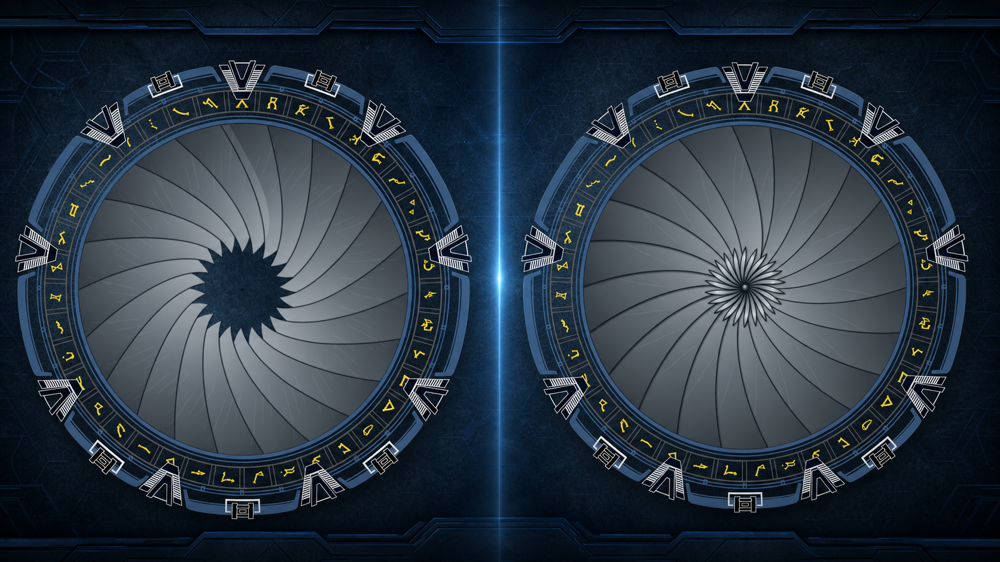
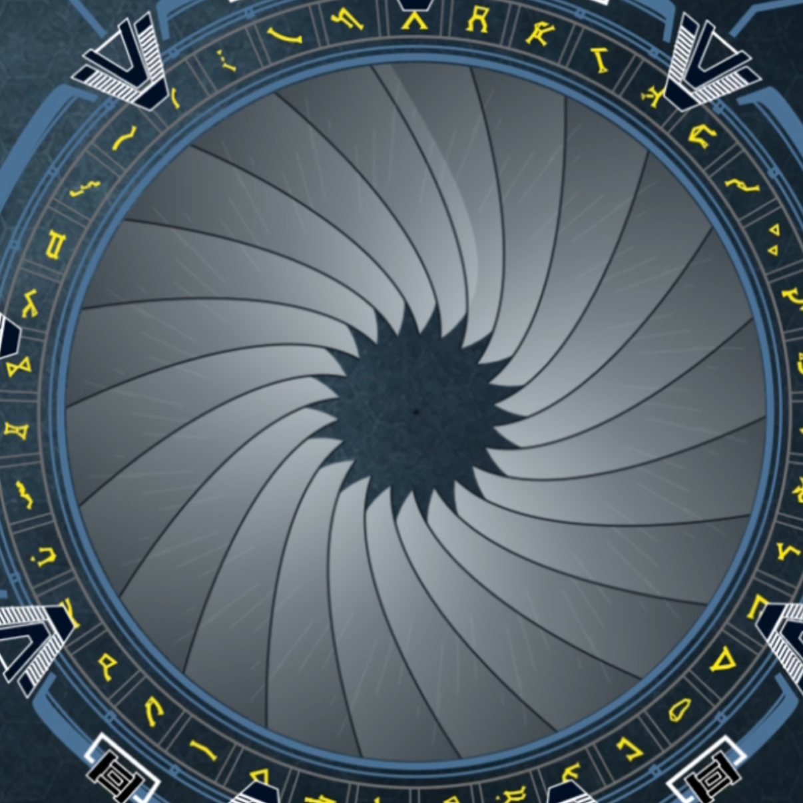
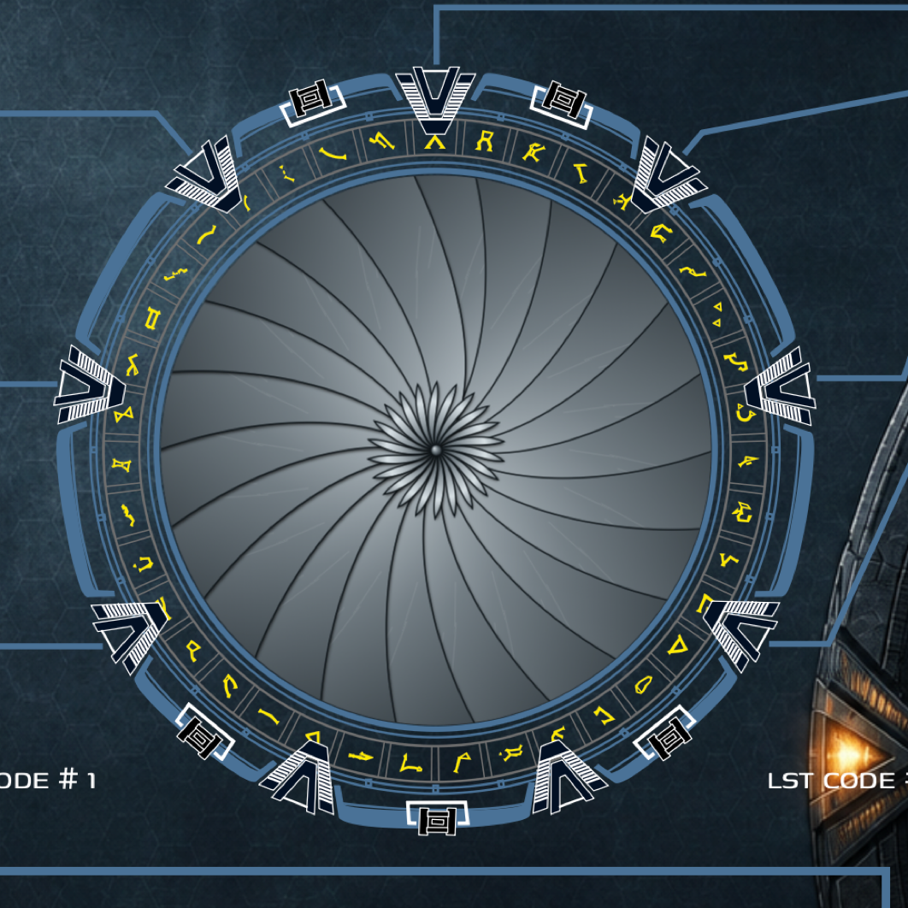

# SG1 Iris

Animated titanium iris add-on for the StargateProject SG1 v4 Retro interface.

The iris uses 22 curved blades, closes with a symmetrical overlapping plume,
and retracts completely below the existing inner Stargate ring when open.
During closing it pauses for one second at two-thirds travel, immediately
before the central plume appears, then completes the closure.
Every incoming dialing sequence automatically closes the iris and keeps it
closed while the incoming status remains active.



## Preview

| One-second pause at two-thirds | Fully closed |
| --- | --- |
|  |  |

The publication-ready PNG files in [`media/`](media/) can also be shared
directly on Discord.

## Requirements

- SG1 v4 installed in `/home/pi/sg1_v4`.
- Retro interface installed in `/home/pi/sg1_v4/web/retro`.
- Raspberry Pi Chromium or another browser with Canvas and ES module support.

## Install

SSH into the Raspberry Pi and run the full install block:

```bash
cd /home/pi
rm -rf SG1-Iris
git clone https://github.com/matelv-x/SG1-Iris.git
cd SG1-Iris
chmod +x install.sh restore.sh
sudo ./install.sh --target /home/pi/sg1_v4
sudo systemctl restart stargate.service
systemctl status stargate.service --no-pager -l
```

After installation, refresh the Retro page without cache. Use the
`CLOSE IRIS` / `OPEN IRIS` control in the Retro navigation menu, or press
`Ctrl+I`.

Quick browser test:

```text
http://stargate.local/retro/dial.html
```

If your gate uses a different local name or IP address, open the same Retro path
on that address instead.

## Dry run

```bash
sudo ./install.sh --target /home/pi/sg1_v4 --dry-run
```

## Restore / uninstall

```bash
cd /home/pi/SG1-Iris
sudo ./restore.sh --target /home/pi/sg1_v4
sudo systemctl restart stargate.service
```

## What it changes

- Adds `web/retro/js/iris.js`.
- Adds `web/retro/css/iris.css`.
- Injects only marked stylesheet and script hooks into `dial.html` and
  `dial9.html`.
- Reads the SG1 gate status directly from the web API, so the iris can
  automatically close on incoming without depending on a `dial.js` hook.
- Removes the old marked Iris hook from `web/retro/js/dial.js` when upgrading
  from an earlier SG1 Iris version.
- Preserves the existing rings, glyphs, chevrons and other installed add-ons.
- Creates timestamped backups below `web/backups/`.
- Restore removes only SG1 Iris hooks and managed assets.
- Reinstalling is safe and does not duplicate hooks.

## Control and integration

SG1 Iris has two built-in control options:

Menu:

```text
OPEN IRIS / CLOSE IRIS
```

The menu button is added to the Retro navigation bar and updates its label to
show the available action.

Keyboard:

```text
Ctrl+I
```

Incoming calls close the iris automatically. If you manually open the iris
during the same incoming wormhole, the add-on respects that manual override
until the gate returns to idle. The next incoming call will close it again.

JavaScript API:

```javascript
sg1Iris.open();
sg1Iris.close();
sg1Iris.toggle();
sg1Iris.isClosed();
```

DOM commands:

```javascript
document.dispatchEvent(new Event("iris:open"));
document.dispatchEvent(new Event("iris:close"));
document.dispatchEvent(new Event("iris:toggle"));
```

## Attribution and originality

Original base project: StargateProject SG1 software from the
BuildAStargate/Kristian/Jonnerd project lineage.

Retro interface credit: [polklabs/stargate-retro](https://github.com/polklabs/stargate-retro).

matelv-x/Codex modification: this repository adds the standalone animated iris,
its SG1 v4 installer, backup workflow and surgical restore tooling.
